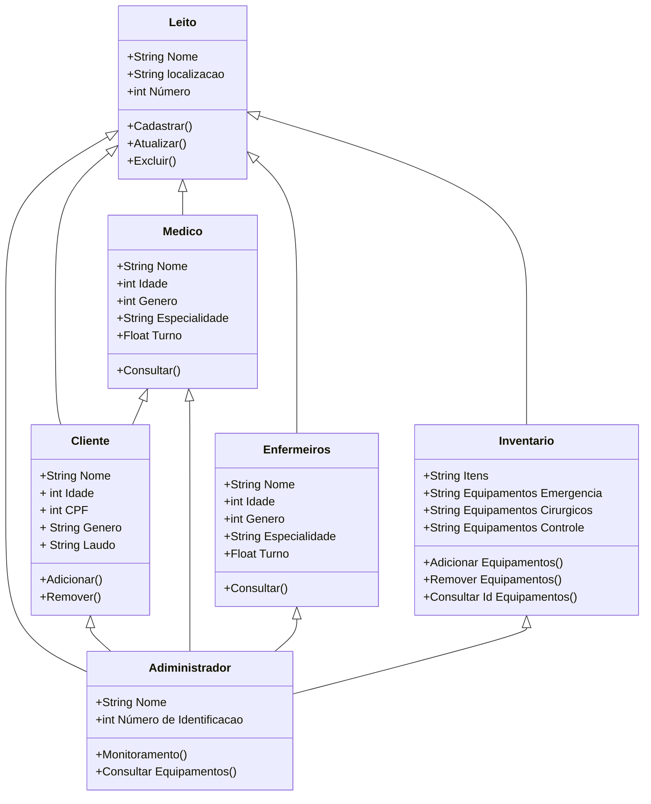

+Remover()
    }
    class Medico{
      +String Nome
      +int Idade
      +int Genero
      +String Especialidade
      +Float Turno
      +Consultar()
    }
    class Adiministrador{ 
        +String Nome# Caso de Uso: CU001

## Nome

Casos de Uso Leito Unimar

## Descrição

Este caso de uso descreve as interações entre os diversos atores (Administrador, Médico, Enfermeiro, Cliente) e o sistema de automação de leitos, abrangendo as funcionalidades de gerenciamento de leitos, clientes/pacientes, médicos, enfermeiros e inventário.

## Atores

* Administrador
* Médico
* Enfermeiro
* Cliente (Paciente)

## Pré-condições

1. O sistema de automação de leitos está em funcionamento.
2. O ator relevante (Administrador, Médico, Enfermeiro, Cliente) está logado no sistema com as permissões apropriadas.
3. Dados básicos (leitos, médicos, enfermeiros) estão cadastrados no sistema, se necessário para a operação específica.

## Fluxo Básico

1. O ator acessa a funcionalidade desejada (Gerenciamento de Leitos, Gerenciamento de Clientes, Gerenciamento de Inventário, etc.).
2. O sistema exibe a interface correspondente.
3. O ator realiza a operação desejada (Ex: cadastrar um novo leito, internar um paciente, consultar um inventário).
4. O sistema processa a requisição e atualiza os dados, se aplicável.
5. O sistema exibe uma mensagem de sucesso ou o resultado da operação ao ator.

## Fluxos Alternativos

### Gerenciar Leitos (Administrador)

1. O Administrador acessa a funcionalidade de "Gerenciamento de Leitos".
2. **Alternativa: Atualizar Leito.**
    * O Administrador seleciona um leito existente na lista.
    * O Administrador clica em "Atualizar Leito".
    * O Administrador modifica as informações do leito (Nome, Localização, Número).
    * O sistema atualiza o leito e exibe confirmação.
3. **Alternativa: Excluir Leito.**
    * O Administrador seleciona um leito existente na lista.
    * O Administrador clica em "Excluir Leito".
    * O sistema solicita confirmação.
    * O Administrador confirma a exclusão.
    * O sistema remove o leito e exibe confirmação.

### Gerenciar Clientes (Administrador, Médico, Enfermeiro)

1. O ator acessa a funcionalidade de "Gerenciamento de Clientes".
2. **Alternativa: Adicionar Cliente.**
    * O ator clica em "Adicionar Cliente".
    * O ator preenche os dados do cliente (Nome, Idade, CPF, Gênero, Laudo).
    * O sistema adiciona o cliente e exibe confirmação.
3. **Alternativa: Remover Cliente.**
    * O ator seleciona um cliente existente na lista.
    * O ator clica em "Remover Cliente".
    * O sistema solicita confirmação.
    * O ator confirma a remoção.
    * O sistema remove o cliente e exibe confirmação.

### Consultar (Médico, Enfermeiro)

1. O Médico/Enfermeiro acessa a funcionalidade de "Consultar" (pacientes, leitos, etc.).
2. **Alternativa: Filtrar por especialidade/turno.**
    * O Médico/Enfermeiro aplica filtros para refinar a consulta.
    * O sistema exibe os resultados filtrados.

## Fluxos de Exceção

### Leito Indisponível para Internação

1. O sistema tenta internar um paciente em um leito que já está ocupado ou bloqueado.
2. O sistema exibe uma mensagem de erro informando que o leito selecionado está indisponível.
3. O fluxo retorna para o passo de seleção do leito.

### Dados Inválidos/Faltantes no Cadastro

1. O ator tenta cadastrar um Leito, Cliente, Médico, Enfermeiro ou Item de Inventário com informações inválidas (ex: CPF duplicado, campos obrigatórios em branco) ou em formato incorreto.
2. O sistema valida os dados e exibe mensagens de erro específicas para cada campo inválido/faltante.
3. O sistema não permite o cadastro até que os dados sejam corrigidos.

## Pós-condições

1. Os dados do sistema são atualizados de acordo com a operação realizada (leito cadastrado/atualizado/excluído, cliente adicionado/removido, etc.).
2. O sistema permanece em um estado consistente e pronto para a próxima interação do usuário.
3. Logs de auditoria são registrados para operações críticas.

## Requisitos Relacionados

-   **RQ_LEITO01:** O sistema deve permitir o cadastro de novos leitos.
-   **RQ_LEITO02:** O sistema deve permitir a atualização de informações de leitos existentes.
-   **RQ_LEITO03:** O sistema deve permitir a exclusão de leitos.
-   **RQ_CLIENTE01:** O sistema deve permitir a adição de clientes/pacientes.
-   **RQ_CLIENTE02:** O sistema deve permitir a remoção de clientes/pacientes.
-   **RQ_ADM01:** O administrador deve ser capaz de monitorar leitos e consultar equipamentos.
-   **RQ_MEDICO01:** O médico deve ser capaz de consultar informações de pacientes e leitos.
-   **RQ_ENFERMEIRO01:** O enfermeiro deve ser capaz de consultar informações de pacientes e leitos.
-   **RQ_INV01:** O sistema deve permitir adicionar equipamentos ao inventário.
-   **RQ_INV02:** O sistema deve permitir remover equipamentos do inventário.
-   **RQ_INV03:** O sistema deve permitir consultar equipamentos no inventário por ID.

## Interface de Usuário

As interfaces de usuário para este caso de uso incluirão telas para:
* **Gerenciamento de Leitos:** Formulário de cadastro/edição de leitos, lista de leitos com opções de atualização e exclusão.
* **Gerenciamento de Clientes:** Formulário de cadastro/edição de clientes, lista de clientes com opções de adicionar e remover.
* **Gerenciamento de Médicos:** Formulário de cadastro/edição de médicos, lista de médicos.
* **Gerenciamento de Enfermeiros:** Formulário de cadastro/edição de enfermeiros, lista de enfermeiros.
* **Monitoramento:** Painel com informações de status de leitos e pacientes.
* **Inventário:** Formulário de adição/remoção de itens, tela de consulta de inventário.

Referência aos protótipos de média fidelidade desenvolvidos no Figma: 
(https://www.figma.com/design/P2PxSooPLkWKxN4GvndRej/ProjetoLeito?node-id=0-1&t=RpAImhDY96Tt2Jdj-1)

## Diagrama

