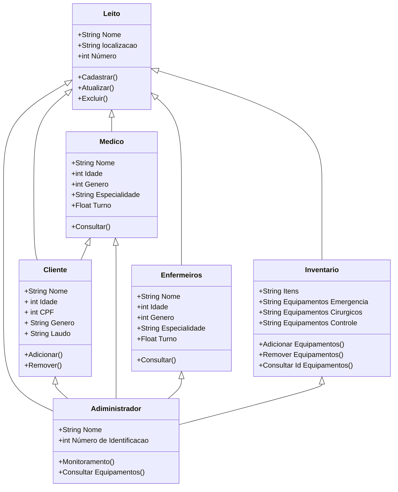
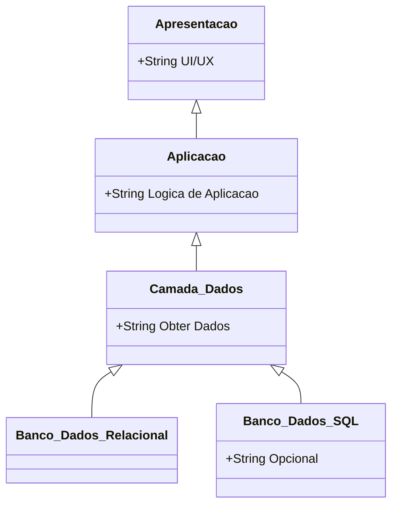

# Diagrama de Classes

```mermaid
classDiagram
    Leito <|-- Cliente
    Leito <|-- Medico
    Medico <|-- Cliente
    Leito<|-- Enfermeiros
    Leito <|-- Adiministrador
    Cliente<|-- Adiministrador
    Medico<|-- Adiministrador
    Enfermeiros<|-- Adiministrador
    Inventario<|-- Adiministrador
    Leito<|-- Inventario
    Leito : +String Nome
    Leito : +String localizacao
    Leito : +int Número
    Leito: +Cadastrar()
    Leito: +Atualizar()
    Leito: +Excluir()

    class Cliente{
      +String Nome
      + int Idade
      + int CPF
      + String Genero
      + String Laudo
      +Adicionar()
      +Remover()
    }
    class Medico{
      +String Nome
      +int Idade
      +int Genero
      +String Especialidade
      +Float Turno
      +Consultar()
    }
    class Adiministrador{ 
        +String Nome
        +int Número de Identificacao
        +Monitoramento()
        +Consultar Equipamentos()
    }
    class Inventario{
        +String Itens
        +String Equipamentos Emergencia
        +String Equipamentos Cirurgicos
        +String Equipamentos Controle
        +Adicionar Equipamentos()
        +Remover Equipamentos()
        +Consultar Id Equipamentos()
     }
    class Enfermeiros{ 
      +String Nome
      +int Idade
      +int Genero
      +String Especialidade
      +Float Turno
      +Consultar()
    }
```

```mermaid
classDiagram
        Apresentacao <|-- Aplicacao
        Aplicacao <|-- Camada_Dados
        Camada_Dados <|-- Banco_Dados_Relacional
        Camada_Dados <|--  Banco_Dados_SQL
        class Apresentacao {
          +String UI/UX
        }
        class Aplicacao {
          +String Logica de Aplicacao
        }
        class Camada_Dados {
          +String Obter Dados
        }

           class Banco_Dados_Relacional{
        }

           class Banco_Dados_SQL {
          +String Opcional
        }


```
